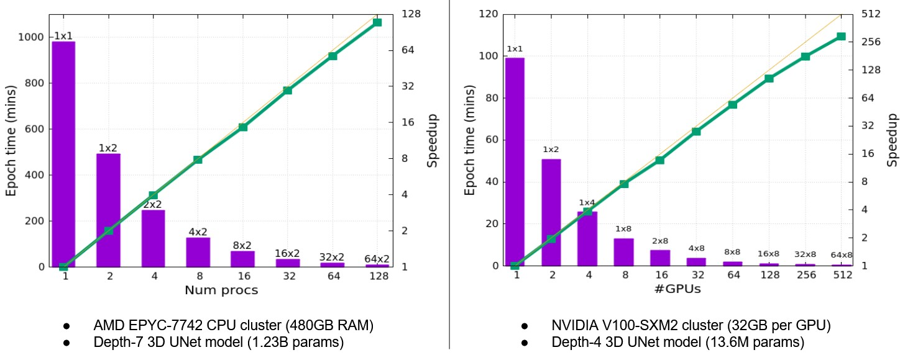
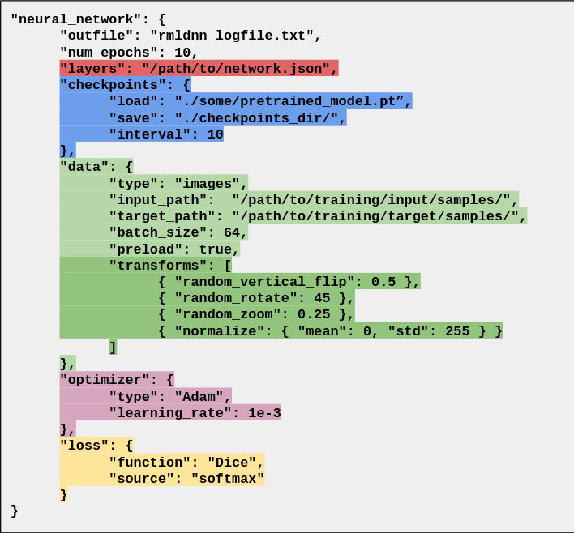

# rmldnn

RocketML Deep Neural Networks
-----------------------------

**rmldnn** is a command-line tool that makes deep-learning models easy to build and fast to train. It does not require knowledge of any deep-learning framework (Pytorch, Tensorflow, Keras, etc) or any Python code. Using rmldnn, one can build deep-learning models on either a small single-GPU laptop or a large supercomputer with hundreds of GPUs or CPUs without any prior knowledge of distributed computing.

In a nutshell, to launch a deep-learning training or inference run, one only needs to do the following at the command line:

    $ rmldnn --config=config.json

The entire run is configured in the JSON file `config.json`. This file controls everything from hyperparameters to output file names. It is composed of several sections (JSON objects) which configure different aspects of the deep-learning run (e.g., network, optimizes, data loader, etc). More on the configuration file in the [concepts](#concepts) section.

# Contents

- [Why rmldnn?](#why-rmldnn)
- [Benefits](#benefits)
- [Who is this for?](#who-is-this-for)
- [Who is this not for?](#who-is-this-not-for)
- [Concepts](#concepts)
- [Install](#install)
- [Usage](#usage)
- [Applications](#applications)
- [Publications](#publications)
- [Talks](#talks)
- [Citation](#citation)


# Why rmldnn?

**rmldnn** was built from the start with two main design principles in mind:

- **Ease-of-use:** Simple, code-free, configuration-based command-line interface
- **Uncompromising performance**: Blazing-fast speeds and HPC-grade scalability on GPU/CPU clusters

The plots below show rmldnn scalability results (time per epoch as function of number of processes) to train two different 3D Unet models 
on large scale CPU and GPU clusters, achieving almost linear speedups on up to 128 CPU processes (7680 cores) and on 512 GPUs.



# Benefits

- Does not require any knowledge of deep-learning frameworks (Pytorch, Keras, etc) or Python.
- Is designed with scalability & performance in mind from the get-go.
- Is agnositc to machine and processor architectures, running seamlessly on both CPU and GPU systems.
- Runs on anything from one to hundreds of GPUs or CPUs without any required knowledge of distributed computing, automatically managing data partitioning and communication among nodes.
- Allows building models for different computer vision use-cases like image classification, object detection, image segmentation, autoencoders, and generative networks.

# Who is this for?

- Researchers who are solving image classification, object detection, or image segmentation problems in their respective fields using deep-learning.
- Data scientists with experience in `scikit-learn` and venturing into deep learning.
- Data scientists who need to scale their single-process deep-learning solutions to multiple GPUs or CPUs.
- Data scientists who want to train deep-learning models without writing boilerplate code in Python/Pytorch/Tensorflow.
- Newcomers to the field of machine learning who want to experiment with deep-learning without writing any code.

# Who is this *not* for?

- Data scientists or developers who are experienced writing more advanced deep-learning code and need maximum flexibility to implement their own custom layers, optimizes, loss functions, data loaders, etc.

# Concepts

**rmldnn** implements the *data-parallel* distributed deep-learning strategy, where multiple replicas of the model are simultaneously trained
by independent processes on local subsets of data to minimize a common objective function, as depicted below.

<p align="center">
  
</p>

The entire training (or inference) run is configured in the json file passed in as input to rmldnn.
This file controls everything from log file names to hyperparameter values.
It contains a few json blocks responsible for configuring different modules, e.g.,
a **data** block that configures the data-loader (input location, data transforms, etc.),
**optimizer** and **loss** blocks that control what optimization method and loss function to use, and so on.
The neural network is defined as a [Keras](https://keras.io/) file and passed into the parameter **layers**.
A typical config file example is shown below, and several other examples are available in the
[tutorials](https://github.com/rocketmlhq/rmldnn/tree/main/tutorials).
Details about all rmldnn options and capabilities can be found in the [documentation](https://rocketmlhq.github.io/rmldnn/).

<p align="center">
  
</p>


# Install

**rmldnn** is available as [Docker](https://www.docker.com/) and [Singularity](https://sylabs.io/singularity) images.
This substantially simplifies the installation process and increases portability.
                                               
If starting from scratch (i.e., no previous installation exists) and the user has no preference, we recommend
going with Singularity, as it is simpler to setup and makes it easier to execute.

- Docker

  - If not already available, follow instructions [here](https://docs.docker.com/engine/install/) to install Docker on your system.
  - Pull the latest rmldnn image from DockerHub:
  ```
   $ sudo docker pull rocketml/rmldnn:latest
  ```

- Singularity

  - If not already available, follow instructions [here](https://sylabs.io/guides/3.9/user-guide/quick_start.html#quick-installation-steps)
    to install SingularityCE on your system.
  - The image can be created by pulling from DockerHub and converting to Singularity in the same step:
  ```
   $ sudo singularity build rmldnn.sif docker://rocketml/rmldnn:latest
   $ export RMLDNN_IMAGE=`realpath ./rmldnn.sif`
  ```

# Usage

We will use the smoke tests in this repo to demonstrate how to run rmldnn on one or two processes using both Docker or Singularity containers.
First, clone the current repo:
  ```
   $ git clone https://github.com/rocketmlhq/rmldnn
   $ cd rmldnn/smoke_tests/
  ```

- Docker

  - We will run under user `ubuntu`, mount the current directory as `/home/ubuntu` inside the container,
    and use that as our work directory (if running on GPUs, add the option `--gpus=all` to the command):
  ```
   $ sudo docker run --cap-add=SYS_PTRACE [--gpus=all] \
     -u ubuntu -v ${PWD}:/home/ubuntu -w /home/ubuntu rocketml/rmldnn:latest \
     rmldnn --config=config_rmldnn_test.json
  ```
  - To run in parallel on a CPU system, use the `-np` option of `mpirun` to indicate how many processes to launch 
    and the variable `OMP_NUM_THREADS` to indicate how many threads each process will use.
    E.g., on a system with 32 CPU cores, one might want to launch 4 processes using 8 cores each:
  ```
   $ sudo docker run --cap-add=SYS_PTRACE -u ubuntu -v ${PWD}:/home/ubuntu -w /home/ubuntu \
     rocketml/rmldnn:latest mpirun -np 4 --bind-to none -x OMP_NUM_THREADS=8 \
     rmldnn --config=config_rmldnn_test.json
  ```
  - On a multi-GPU system, the variable `CUDA_VISIBLE_DEVICES` must be set to indicate which devices to use.
    E.g., on a 4-GPU system, the following command can be used to launch a 4x parallel run:
  ```
   $ sudo docker run --cap-add=SYS_PTRACE --gpus=all -u ubuntu -v ${PWD}:/home/ubuntu -w /home/ubuntu \
     rocketml/rmldnn:latest mpirun -np 4 -x CUDA_VISIBLE_DEVICES=0,1,2,3 \
     rmldnn --config=config_rmldnn_test.json
  ```

- Singularity

  Set the environment variable `RMLDNN_IMAGE` to the location of the rmldnn Singularity image (see [install](#install) section).
                                               
  - To run rmldnn on a single process (add `--nv` if running on a GPU):
  ```
   $ singularity exec [--nv] ${RMLDNN_IMAGE} rmldnn --config=./config_rmldnn_test.json
  ```
  - To run in parallel on a CPU system, use the `-np` option of `mpirun` to indicate how many processes to launch 
    and the variable `OMP_NUM_THREADS` to indicate how many threads each process will use:
  ```
   $ singularity exec ${RMLDNN_IMAGE} mpirun -np 4 --bind-to none -x OMP_NUM_THREADS=8 \
     rmldnn --config=./config_rmldnn_test.json
  ```
  - To run in parallel on a GPU system, add the `--nv` option and set the variable `CUDA_VISIBLE_DEVICES` accordingly:
  ```
   $ singularity exec --nv ${RMLDNN_IMAGE} mpirun -np 4 -x CUDA_VISIBLE_DEVICES=0,1,2,3 \
     rmldnn --config=./config_rmldnn_test.json
  ```

# Applications

Please take a look at the [tutorials](https://github.com/rocketmlhq/rmldnn/tree/main/tutorials)
available in this repo for examples of how to use rmldnn to tackle
real-world deep-learning problems in the areas of:

- Image classification
- 2D and 3D image segmentation
- Self-superviside learning
- Transfer learning
- Object detection
- Neural PDE solvers
- Generative adversarial networks (GANs)

# Publications

- Sergio Botelho, Ameya Joshi, Biswajit Khara, Vinay Rao, Soumik Sarkar, Chinmay Hegde, Santi Adavani, and Baskar Ganapathysubramanian. **Deep generative models that solve pdes: Distributed computing for training large data-free models.**, *2020 IEEE/ACM Workshop on Machine Learning in High Performance Computing Environments (MLHPC) and Workshop on Artificial Intelligence and Machine Learning for Scientific Applications (AI4S)*, pp. 50-63. IEEE, 2020. ([paper](https://arxiv.org/abs/2007.12792v1))

- Aditya Balu, Sergio Botelho, Biswajit Khara, Vinay Rao, Soumik Sarkar, Chinmay Hegde, Adarsh Krishnamurthy, Santi Adavani, and Baskar Ganapathysubramanian. **Distributed multigrid neural solvers on megavoxel domains**, *Proceedings of the International Conference for High Performance Computing, Networking, Storage and Analysis (SC '21).* Association for Computing Machinery, New York, NY, USA, Article 49, 1–14. ([paper](https://doi.org/10.1145/3458817.3476218))

- Rade, J., Balu, A., Herron, E., Jignasu, A., Botelho, S., Adavani, S., Sarkar, S., Ganapathysubramanian, B. and Krishnamurthy, A., 2021, November. **Multigrid Distributed Deep CNNs for Structural Topology Optimization**, *AAAI 2022 Workshop on AI for Design and Manufacturing (ADAM)*. ([paper](https://openreview.net/pdf?id=BJSHAXe-XZz))

- Botelho, S., Das, V., Vanzo, D., Devarakota, P., Rao, V. and Adavani, S., 2021, November. **3D seismic facies classification on CPU and GPU HPC clusters**, *SPE/AAPG/SEG Asia Pacific Unconventional Resources Technology Conference* ([paper](https://onepetro.org/URTECAP/proceedings/21APUR/1-21APUR/D012S001R026/472261))

- Mukherjee, S., Lelièvre, P., Farquharson, C. and Adavani, S., 2021, September. **Three-dimensional inversion of geophysical field data on an unstructured mesh using deep learning neural networks, applied to magnetic data**, *First International Meeting for Applied Geoscience & Energy* (pp. 1465-1469). Society of Exploration Geophysicists. ([paper](https://library.seg.org/doi/abs/10.1190/segam2021-3583565.1))

# Talks

- [Scientific Machine Learning talk at Rice Energy HPC conference 2022](https://www.youtube.com/watch?v=YJn0vACwnH0)
- [CVPR 2021 Distributed Deep Learning Workshop](https://youtube.com/playlist?list=PLcK0exoS00ZRbYP4VATWX791kxdEf6ckf)
- [SC21 Scientific Machine Learning Tutorial](https://youtube.com/playlist?list=PLcK0exoS00ZTPdvhmh0IdyCIlVQ2lzjJ5)
- [3D Seismic Facies Classification using Distributed Deep Learning](https://www.youtube.com/watch?v=uerDzx1GB0k)
                                               
# Citation

Please cite rmldnn in your publications if it helps your research:
                                               
```
@software{rmldnn,
  author = {{RocketML Inc}},
  title = {Rocket{ML} {Deep} {Neural} {Networks}},
  url = {https://rocketml.net},
  howpublished = {\url{https://github.com/rocketmlhq/rmldnn}}
}
```
