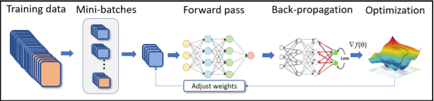

# rmldnn
RocketML Deep Neural Networks

RMLDNN is a command-line tool to build deep learning models. To use rmldnn, you do not need to know Python and deep learning frameworks like Pytorch or Tensorflow. Using rmldnn, you can build deep learning models on a laptop with a single GPU or on a data center/supercomputer with 100s of GPUs without any prior knowledge of distributed computing.

To launch a deep-learning run one has to do the following at the command line:

`rmldnn --config=<json_config_file>`

Every possible aspect of how the run is configured must be passed in the JSON file specified with the --config command-line argument. This file controls everything from log file names to hyperparameter values, all the way to details of every layer in the network. It is composed of several sections (JSON objects) which configure different aspects of the deep-learning run (e.g., optimizer parameters, data loader type, etc), some of which are specific to the type of application being executed. More on the configuration file in [concepts](#concepts) section.

# Contents

- [Benefits](#benefits)
- [Who is this for?](#who-is-this-for)
- [Who is this not for?](#who-is-this-not-for)
- [Install](#install)
- [Concepts](#concepts)
- [Usage](#usage)
- [Applications](#applications)
- [Guides](#guides)
- [Troubleshooting](#troubleshooting)
- [FAQs](#faqs)
- [Citation](#citation)
- [Publications](#publications)
- [Talks](#talks)

# Benefits

- Skip writing boilerplate Python code in Tensorflow/Pytorch and build high-performance deep learning models faster
- Designed for scalability & performance so you can focus on achieving optimal deep learning model
- Boost your productivity by using the CLI for building models for different computer vision use cases like image classification, object detection, image segmentation and autoencoders.
- Run on 1-100s of GPUs or CPUs without any knowledge of distributed computing. RMLDNN will manage CPU and GPU memory, I/O, data communication between GPUs, and other complex details.

# Who is this for?

- Researchers who are solving image classification, object detection, or image segmentation problems in their respective fields using deep learning.
- Data scientists with experience in scikit-learn and venturing into deep learning.
- Data scientists who need to scale their deep learning solution that works on a single GPU to multiple GPUs.
- Data scientists who want to solve deep learning problems without writing boilerplate code in Python/Pytorch/Tensorflow.
- Newcomers to the field of machine learning who understand deep learning basics and want to build models quickly.

# Who is this not for?

- Data scientists who can build new neural network layers, neural network architectures, loss functions, and optimizers.

# Install

- Docker
  - docker pull
- Singularity
  - singularity pull

# Concepts

To launch a deep-learning run from the command line, one has to do:

`rmldnn --config=<json_config_file>`

Every possible aspect of how the run is configured must be passed in the JSON file specified with the --config command-line argument. This file controls everything from log file names to hyperparameter values, all the way to details of every layer in the network. It is composed of several sections (JSON objects) which configure different aspects of the deep-learning run (e.g., optimizer parameters, data loader type, etc), some of which are specific to the type of application being executed. 



As shown in the figure, a typical training process will need a data set, a deep learning model represented by a network architecture like ResNet50, U-Net etc. that is used to calculate the loss value using a function like NLL, BCE, Dice etc., back-propagation to compute gradients, and an optimizer like SGD, Adam etc. to update model weights. The json file must contain one single object named neural_network, inside which all these configurations will reside:


    {
        "neural_network": {
            "outfile": "log_file.txt",
            "num_epochs": 100,
            "data": {
                ...
            }
            "layers": {
                ...
            },
            "loss": {
                ...
            },
            "optimizer": {
                ...
            }                       
        }
    }

**Data** section is where the types of training and test data are configured, in particular, what specific data loader will be used to feed data into the neural network, as well as how that data will be split into mini-batches, how many samples will be used for training and evaluation, etc.

**Layers** section allows for detailed specification of all layers in the neural network, as well as the connections between them. The syntax is supposed to follow closely the one used by Keras, which allows exporting a programmatically built neural network as a json file.

**Loss** section specifies which loss function to use for the neural network. The loss function computes some kind of metric that estimates the error (loss) between the network result for a given input and its corresponding target. The choice of loss function must be consistent with the network design, in particular, with the last layer in the network and its activation.

**Optimizer** section configures the optimizer for the neural network, which can be selected with the parameter type. We support the most important first-order algorithms available in PyTorch (module torch.optim), as well as a Hessian-based second-order optimizer. Each optimizer type has its own set of supported hyper-parameters.


# Usage

- Single GPU
  - Docker
    ```
      docker run –gpus all -it /bin/bash
      rmldnn –config= ./<configuration_file>
    ```
  - Singularity
  singularity exec .. 

- Single node with multiple GPUs
  - Docker

- Multiple-nodes with multiple GPUs
  - Singularity
  - RocketML managed platform 
  - AWS
  - Azure

# Applications

- Image Classification
- 2D Image Segmentation
- 3D Image Segmentation
- Object Detection
- Transfer Learning
- Self-supervision
- Generative Adversarial Networks

# Guides

- RocketML
- AWS
- Azure

# Troubleshooting

Submit a ticket with as many details as possible for of your issue

# FAQs

# Citation

# Publications

- Botelho, Sergio, Ameya Joshi, Biswajit Khara, Vinay Rao, Soumik Sarkar, Chinmay Hegde, Santi Adavani, and Baskar Ganapathysubramanian. "Deep generative models that solve pdes: Distributed computing for training large data-free models." In 2020 IEEE/ACM Workshop on Machine Learning in High Performance Computing Environments (MLHPC) and Workshop on Artificial Intelligence and Machine Learning for Scientific Applications (AI4S), pp. 50-63. IEEE, 2020.

- Aditya Balu, Sergio Botelho, Biswajit Khara, Vinay Rao, Soumik Sarkar, Chinmay Hegde, Adarsh Krishnamurthy, Santi Adavani, and Baskar Ganapathysubramanian. 2021. Distributed multigrid neural solvers on megavoxel domains. In Proceedings of the International Conference for High Performance Computing, Networking, Storage and Analysis (SC '21). Association for Computing Machinery, New York, NY, USA, Article 49, 1–14. DOI:https://doi.org/10.1145/3458817.3476218

- Rade, J., Balu, A., Herron, E., Jignasu, A., Botelho, S., Adavani, S., Sarkar, S., Ganapathysubramanian, B. and Krishnamurthy, A., 2021, November. Multigrid Distributed Deep CNNs for Structural Topology Optimization. In AAAI 2022 Workshop on AI for Design and Manufacturing (ADAM).

- Botelho, S., Das, V., Vanzo, D., Devarakota, P., Rao, V. and Adavani, S., 2021, November. 3D seismic facies classification on CPU and GPU HPC clusters. In SPE/AAPG/SEG Asia Pacific Unconventional Resources Technology Conference. OnePetro.

- Mukherjee, S., Lelièvre, P., Farquharson, C. and Adavani, S., 2021, September. Three-dimensional inversion of geophysical field data on an unstructured mesh using deep learning neural networks, applied to magnetic data. In First International Meeting for Applied Geoscience & Energy (pp. 1465-1469). Society of Exploration Geophysicists.

# Talks

- [Scientific Machine Learning talk at Rice Energy HPC conference 2022](https://www.youtube.com/watch?v=YJn0vACwnH0)
- [CVPR 2021 Distributed Deep Learning Workshop](https://youtube.com/playlist?list=PLcK0exoS00ZRbYP4VATWX791kxdEf6ckf)
- [SC21 Scientific Machine Learning Tutorial](https://youtube.com/playlist?list=PLcK0exoS00ZTPdvhmh0IdyCIlVQ2lzjJ5)
- [3D Seismic Facies Classification using Distributed Deep Learning](https://www.youtube.com/watch?v=uerDzx1GB0k)
