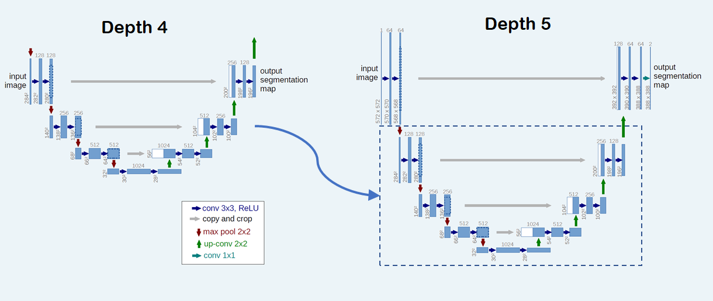

Transfer Learning
-----------------

Transfer learning can be realized in :code:`rmldnn` by leveraging the checkpointing system described above, 
and by making (hopefully small) changes to the network files. When training a network on dataset
:math:`D_1`, enable checkpoint saving with

.. code-block:: bash

    "checkpoints": {
        "save": "./checkpoints_D1/"
        "interval": 10,
    }

Now, to transfer learning when training the same network with a new dataset :math:`D_2`, load the model
saved during :math:`D_1` training:

.. code-block:: bash

    "checkpoints": {
        "load": "./checkpoints_D1/model_checkpoint_100.pt",
        "save": "./checkpoints_D2/"
        "interval": 10,
    }

Two main use cases can occur depending on the type of network:

**1. Purelly convolutional networks**

In this case, the layers of the network are agnostic to the training sample sizes (as long as the tensors
have the same rank) and, therefore, do not need to be changed when transfering learning.
The only adjustment needed in the network file is the input size, usually defined in 
the first layer (e.g., InputLayer):

.. code-block:: bash

    {
        "class_name": "InputLayer",
            "config": {
                "batch_input_shape": [
                    null,
                    128,
                    128,
                    1
                ],
            "dtype": "float32"
            "name": "input_1",
        },
        "inbound_nodes": []
    }

**2. Networks with fixed-size layers**

If the network contains layers whose configuration depends on the size of the training samples
(e.g., Dense), then the parameters for those layers cannot be transferred from a model trained 
on a dataset with different size samples. In this case, those layers have to be renamed in the
network file and retrained with the new dataset. When loading the model, :code:`rmldnn` will warn
about layers whose parameters cannot be transfered:

.. code-block:: bash

    Loading model checkpoint from file: ./checkpoints_D1/model_checkpoint_100.pt
       Skipping layer dense_128_1: not found in model
       Skipping parameter dense_128_1.weight: not found in model
       Skipping parameter dense_128_1.bias: not found in model
    ...

**Application: multigrid training**

One can leverage transfer learning to emulate the multigrid method for solving PDEs by training
models of increasing resolution which are initialized from lower resolution ones. If the network
is fully convolutional, a model trained at a certain resolution (data size) can be completely 
re-utilized when going to higher resolution (i.e., all layer parameters transfered). And even if
the network changes at different resolutions, at least part of the model can perhaps be re-utilized.

For example, in order to train a UNet whose depth increases with resolution, one could simply add
extra layers to the top part of the "U" and keep the bottom layers unchanged (see figure).
The added layers will be trained from scratch, but the majority of the
network (bottom part of the "U") will be initialized from the model trained at lower resolution.

