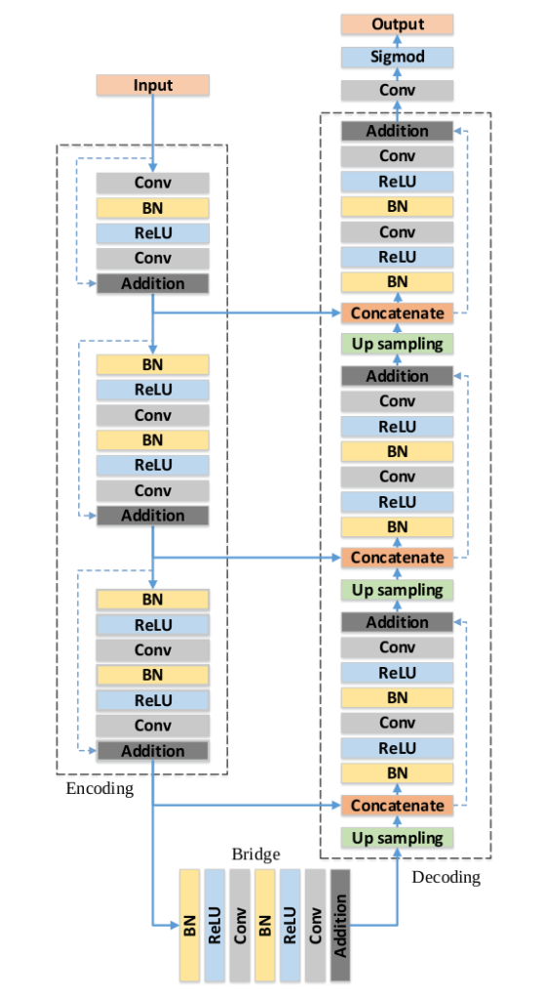
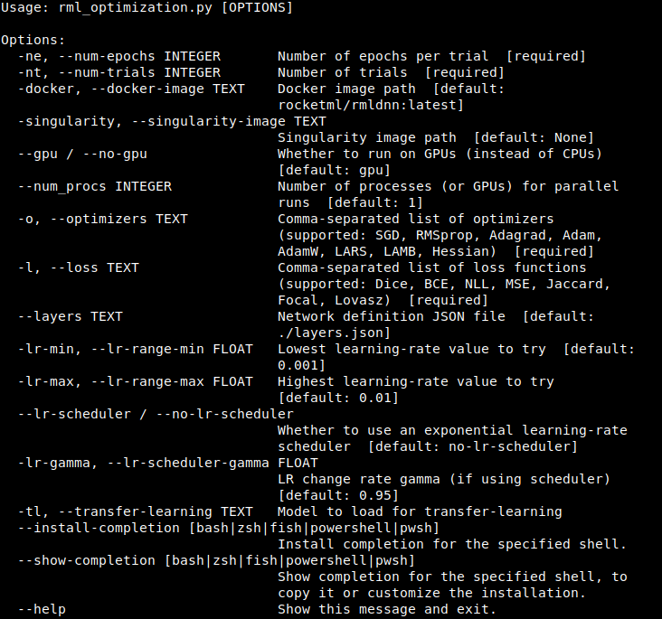
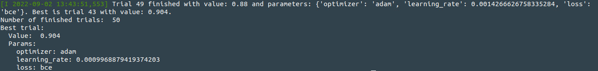
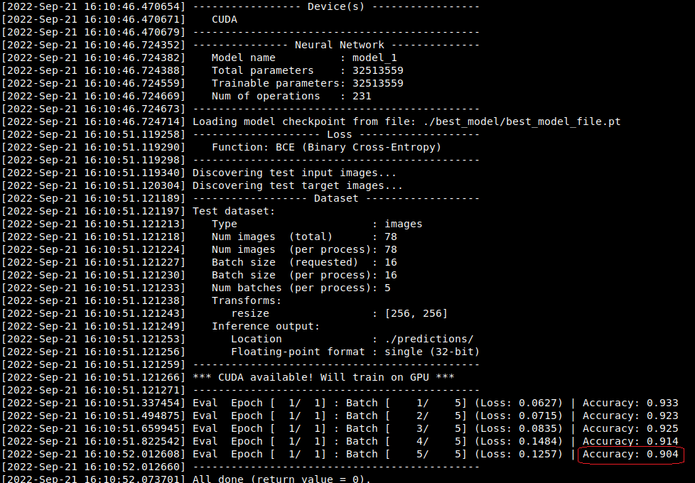

Hyperparameter optimization for breast cancer image segmentation
================================================================

Introduction
~~~~~~~~~~~~

This tutorial discusses how to use **rmldnn** along with the **Optuna** framework to perform hyperparameter optimization for the problem of image semantic segmentation.

*Hyperparameter Optimization* is the process of searching for an optimal set of hyperparameters when training a deep-learning model, in such a way as to maximize some given model performance metric (e.g., highest prediction accuracy). It works by running multiple training cycles (or *trials*), each time automatically choosing a new set of hyperparameters to use. These hyperparameter choices are guided by some kind of sampling heuristics, which focuses on regions of the search space that give the best results, thus minimizing the search time. This scheme, as well as its integration with *rmldnn*, are depicted in the figure below.

.. image:: ./figures/flowchart.png?raw=true
    :width: 650
    :align: center
   
What is Optuna?
~~~~~~~~~~~~~~~

`Optuna <https://optuna.readthedocs.io/en/stable/index.html>`__ is an automatic hyperparameter optimization software framework, particularly designed for machine learning. It automatically finds optimal hyperparameter values by making use of different sampling strategies such as grid search, random, Bayesian, and evolutionary algorithms. Some of its features include:

- Eager dynamic search spaces
- Efficient sampling and pruning algorithms
- Easy integration
- Good visualizations
- Distributed optimization

In what follows, the term *trial* will always mean a single optimization step (e.g., one deep-learning training cycle
with a fixed set of hyperparameters), yielding a single objective function value.
 
The dataset
~~~~~~~~~~~

We have chosen to demonstrate the above rmldnn-based hyperparameter optimization strategy for the problem of image semantic segmentation
using the `Breast Ultrasound Images Dataset <https://www.kaggle.com/datasets/aryashah2k/breast-ultrasound-images-dataset>`__.
This kaggle dataset consists of 780 images with an average image size of 500 x 500
pixels, collected from around 600 female patients. For convenience, we have already pre-processed the dataset by splitting it
into training and test sets, and it can be downloaded directly from
`here <https://rmldnnstorage.blob.core.windows.net/rmldnn-datasets/breast_cancer.tar.gz>`__ as a ``tar.gz`` archive. 
After expanding the archive, one should end up with the following directory structure:

.. code:: bash

    +-- breast_cancer_segmentation/
    |   +-- data/
        |   +-- train/
            |   +-- inputs/
            |   +-- targets/
        |   +-- test/
            |   +-- inputs/
            |   +-- targets/
        |   +-- sample/
    
The model
~~~~~~~~~

For this task, we will fix the neural network being trained, and use the
`RESUNET architecture <https://arxiv.org/pdf/1711.10684.pdf>`__ (see figure below), an encoder-decoder network created as an improvement to
the `Unet architecture <https://arxiv.org/pdf/1505.04597.pdf>`__. It was initially used for the road extraction from the high-resolution 
aerial images in the field of remote sensing image analysis, and later employed in other applications.
For another example of using RESUNET in the medical image segmentation field, please see our
tutorial on `brain MRI image segmentation <https://github.com/rocketmlhq/rmldnn/tree/main/tutorials/brain_MRI_image_segmentation>`__.

A RESUNET model pre-trained on the Imagenet dataset will be used as starting point for our training cycles below.
It can be downloaded from `here <https://rmldnnstorage.blob.core.windows.net/rmldnn-models/model_resunet_imagenet.h5>`__.

Hyperparameter optimization using RMLDNN
~~~~~~~~~~~~~~~~~~~~~~~~~~~~~~~~~~~~~~~~

Installation steps:

#. Download the python scripts provided here in this repo
   (`rml_optimization.py <./rml_optimization.py>`__  and `rml_optuna.py <./rml_optuna.py>`__)
   and save them in the same directory as your data folder.
#. Install *optuna* and other required libraries

.. code:: bash

    pip install typer optuna tabulate

The driving script that starts the hyperparameter search is ``rml_optimization.py``,
and it accepts several command-line options. To see a list of options, do:

.. code:: bash

    python ./rml_optimization.py --help

A few points about the configuration we will use in our experiment below:

- We want to run 50 trials of the optimization process, thus will use ``--num-trials 50``
- We want to train the model up to 50 epochs on each trial, thus ``--num-epochs 50``
- We will use the latest *rmldnn* Docker image in the system, or ``--docker-image rocketml/rmldnn:latest``
- We will run trials using 3 different optimizers (``--optimizers adam,rmsprop,sgd``) and 2 different loss functions (``--loss bce,dice``)
- The neural network description file is specified with ``--layers ./layers_resunet.json``
- The option ``--lr-scheduler`` engages the learning-rate scheduler (with default parameters)
- We will use transfer-learning by loading a pre-trained RESUNET model: ``--transfer-learning ./model_resunet_imagenet.h5``

We will run our hyperparameter optimization study on a system with a single NVIDIA A100X GPU, using the following command:

.. code:: bash

    python rml_optimization.py --num-trials 50 --num-epochs 50 --docker-image rocketml/rmldnn:latest \
                               --optimizers adam,rmsprop,sgd --loss bce,dice --layers ./layers_resunet.json \
                               --lr-scheduler --transfer-learning ./model_resunet_imagenet.h5

The optimization cycle will take several hours (~10hrs) to run on a single GPU.
Upon completion, it will display the best set of hyperparameters found, as well as the best accuracy obtained with those parameters:

The above figure shows that we managed to achieve an accuracy of 90.4% with the following
hyperparameters: ``{ optimizer: adam, learning_rate: 0.0014266626758335284, loss: bce }``.

The application will also:

- Save the best model under ``./best_model/``
- Write a summary file ``list_acc.json`` listing the hyperparameters used at each trial, as well as the accuracy obtained

Running inference on the best model
~~~~~~~~~~~~~~~~~~~~~~~~~~~~~~~~~~~

We will now use the best performing model to run inference on the test images,
which can be done with the configuration file below (`config_test.json <./config_test.json>`__):

.. code:: bash

    {
        "neural_network": {
            "layers": "./layers_resunet.json",
            "checkpoints": {
                "load": "./best_model/best_model_file.pt"
            },
            "data": {
                "type": "images",
                "test_input_path":  "./data/test/inputs/",
                "test_target_path": "./data/test/targets/",
                "test_output_path": "./predictions/",
                "test_batch_size": 16,
                "target_grayscale": true,
                "target_is_mask": true,
                "transforms": [
                    { "resize": [256, 256] }
                ]
            },
            "loss": {
                "function": "BCE",
                "source": "sigmoid"
            }
        }
    }

By also passing the test **target** images in the configuration and defining a loss function to use,
*rmldnn* will compute the BCE loss and the accuracy (as measured by the Dice coefficient
weighted across all classes).

We can run inference using an *rmldnn* Docker image by doing:

.. code:: bash

    sudo docker run --gpus=all -u $(id -u):$(id -g) -v ${PWD}:/home/ubuntu -w /home/ubuntu --rm \
      rocketml/rmldnn:latest rmldnn --config=config_test.json 

Notice that we obtain our expected 90.4% accuracy, as reported during training.

By passing ``test_output_path = ./predictions/`` in the inference config,
we instructed *rmldnn* to write out the results to an HDF5,
with predictions for each test image being written into a different HDF5 dataset.
We can visualize those predictions by loading each dataset
and showing the images with *matplotlib*:

.. code:: bash

  import numpy as np
  import h5py as h5
  import matplotlib.pyplot as plt

  pred = h5.File('predictions/output_1.h5', 'r')
  for dataset in pred:
      plt.imshow(pred[dataset][0,:,:].round(), cmap="gray")
      plt.show()
   
The figures below show predictions and their corresponding targets for a few input test images:

==================== ==================== ====================
**Inputs**           **Predictions**      **Ground-truths**
-------------------- -------------------- --------------------
|input_1|            |inference_1|        |truth_1|
-------------------- -------------------- --------------------
|input_2|            |inference_2|        |truth_2|
-------------------- -------------------- --------------------
|input_3|            |inference_3|        |truth_3|
-------------------- -------------------- --------------------
|input_4|            |inference_4|        |truth_4|
==================== ==================== ====================

.. |input_1|      image::  ./figures/input_1.png?raw=true
    :width: 300
    :height: 300
.. |input_2|      image::  ./figures/input_2.png?raw=true
    :width: 300
    :height: 300
.. |input_3|      image::  ./figures/input_3.png?raw=true
    :width: 300
    :height: 300
.. |input_4|      image::  ./figures/input_4.png?raw=true
    :width: 300
    :height: 300
.. |inference_1|  image::  ./figures/pred_1.png?raw=true
    :width: 300
    :height: 300
.. |inference_2|  image::  ./figures/pred_2.png?raw=true
    :width: 300
    :height: 300
.. |inference_3|  image::  ./figures/pred_3.png?raw=true
    :width: 300
    :height: 300
.. |inference_4|  image::  ./figures/pred_4.png?raw=true
    :width: 300
    :height: 300
.. |truth_1|      image::  ./figures/truth_1.png?raw=true
    :width: 300
    :height: 300
.. |truth_2|      image::  ./figures/truth_2.png?raw=true
    :width: 300
    :height: 300
.. |truth_3|      image::  ./figures/truth_3.png?raw=true
    :width: 300
    :height: 300
.. |truth_4|      image::  ./figures/truth_4.png?raw=true
    :width: 300
    :height: 300
   
