Pets image semantic segmentation
================================

Introduction
~~~~~~~~~~~~

Semantic segmentation is a process by which an image is broken into various smaller groups called `segments`, which 
identify regions of interest within that image. On digital images, this is usually done by assigning pixels
of different colors to each segment, where each color (pixel value) corresponds to some category of interest. 

Although several image segmentation techniques have been developed over the years (e.g, thresholding, 
histogram-based bundling, k-means clustering, etc), deep-learning has been shown to achieve the best accuracy
on a variety of image segmentation problems.

In this tutorial, we will show how to use `rmldnn` to efficiently train an image segmentation model using
a dataset of cat and dog images. It is based on this 
`Keras tutorial <https://keras.io/examples/vision/oxford_pets_image_segmentation/>`__ for the same task.

The dataset
~~~~~~~~~~~

We will use the `Oxford Pets <https://www.kaggle.com/datasets/tanlikesmath/the-oxfordiiit-pet-dataset>`__
dataset, which contains 37 categories of cats and dogs with roughly 200 images per class, to a total of 7390 images. 
Each image has a corresponding trimap mask file with ground-truth segmentation: pixel value 0 for background, 
1 for the contour and 2 for the animal, as shown below.

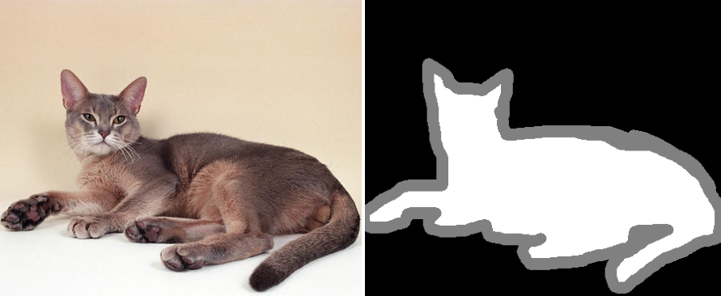
  

The data needs to be pre-processed before training. This is done in the Keras tutorial through code, but
we do it here as an outside step in order to save time when running multiple training experiments. 
We need to:

 - remove non-image files (e.g., ``.mat``) from the dataset
 - partition the images as training (90%) and test (10%) sets
 - subtract one from the mask labels, converting them from ``{1,2,3}`` to ``{0,1,2}``
 - organize images in the following directory structure

.. code:: bash

    +-- oxford_pets/
    |   +-- training/
        |   +-- inputs/
        |   +-- masks/
    |   +-- testing/
        |   +-- inputs/
        |   +-- masks/

The pre-processed dataset can be downloaded directly from 
`here <https://rmldnnstorage.blob.core.windows.net/rmldnn-datasets/oxford_pets.tar.gz>`__
for convenience.

The model
~~~~~~~~~

We will use an Xception-style neural network, which was originally proposed in 
`this <https://arxiv.org/abs/1610.02357>`__ paper. The main idea is to replace the convolution
modules of the popular Inception network with `depthwise separable convolutions`, which results in
fewer trainable parameters. This architecture was shown to outperform Inception on 
classification tasks. The Xception neural network is depicted below, and the Keras-style network
description is provided in the file
`network_xception2D.json <./network_xception2D.json>`__.
A graph view of the neural network is provided 
`here <./graph_xception2D.pdf>`__.

.. image:: ./figures/xception.png
  :width: 1000

Training the model
~~~~~~~~~~~~~~~~~~

To train the Xception model on the pets dataset, we will use the RMSprop optimizer, as done in the Keras tutorial.
However, instead of using a categorical cross-entropy loss function, we will take advantage of `rmldnn`'s implementation
of the Dice loss, which is defined as the complement of the Dice coefficient computed between prediction and target.
First introduced in the context of medical image segmentation
(`paper <https://arxiv.org/abs/1606.04797>`__),
the Dice loss has been shown to perform very well for segmentation tasks in general.

The `rmldnn` configuration file used for training is shown below:

.. code:: bash

    {
        "neural_network": {
            "outfile": "out_dnn_pets_segmentation.txt",
            "num_epochs": 30,
            "layers": "./network_xception2D.json",
            "checkpoints": {
                "save": "model_pets_segmentation/",
                "interval": 5
            },
            "data": {
                "type": "images",
                "input_path":       "./oxford_pets/training/inputs/",
                "target_path":      "./oxford_pets/training/masks/",
                "test_input_path":  "./oxford_pets/testing/inputs/",
                "test_target_path": "./oxford_pets/testing/masks/",
                "batch_size": 64,
                "test_batch_size": 128,
                "preload": true,
                "target_grayscale": true,
                "target_is_mask": true,
                "transforms": [
                    { "resize": [160, 160] },
                    { "normalize": { "mean": 0.0, "std": 0.003921568 } }
                ]
            },
            "optimizer": {
                "type": "rmsprop",
                "learning_rate": 1e-3
            },
            "loss": {
                "function": "Dice",
                "source": "softmax"
            }
        }
    }

A few points to notice in the configuration:

 - Since the targets are grayscale images (single-channel), the parameter ``target_grayscale`` is set to `true`,
   otherwise they would be loaded as 3-channel tensors that would not match the target shape 
   expected by the Dice loss function.
 - The variable ``target_is_mask`` is set to `true` so that target pixels are not linearly interpolated 
   when resizing the image.
 - Since `rmldnn` automatically scales pixel values by 255, a factor of 1/255 = 0.00392 is applied to 
   recover the original values. The last two bullets guarantee that target pixel values remain unchanged.

We will run training for 30 epochs on 4 NVIDIA V100 GPUs using a Singularity image with `rmldnn` 
(see `instructions <https://github.com/rocketmlhq/rmldnn#install>`__ for how to get the image).
Alternatively, one could use a Docker image or a native build on the cloud --
see `usage <https://github.com/rocketmlhq/rmldnn#usage>`__ section for details.

From the command line, one should do:

.. code:: bash

  $ singularity exec --nv ./rmldnn_image.sif \
    mpirun -np 4 -x CUDA_VISIBLE_DEVICES=0,1,2,3 \
    rmldnn --config= ./config_pets_segmentation.json

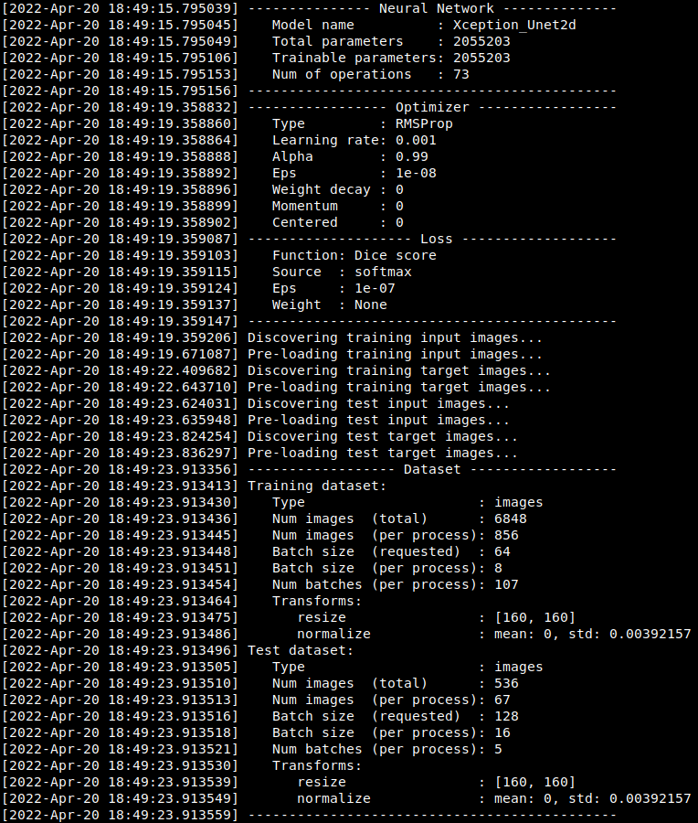

It takes about 10 minutes to train for 30 epochs on 4 GPUs. 
We can monitor the evolution of the training loss, which is reported in the log file
``out_dnn_pets_segmentation_train.txt``. Although the loss has fallen substantially by the 30th epoch, it hasn't 
yet fully reached a stationary value, and training by a few more epochs would have probably further improved
the model somewhat.

.. image:: ./figures/training_loss.png
  :width: 600
  :align: center

The test accuracy, reported in the file ``out_dnn_pets_segmentation_test.txt``, shows that we have reached
an accuracy of ~80% on the test dataset (as measured by the Dice coefficient averaged across all classes).

.. image:: ./figures/test_accuracy.png
  :width: 600
  :align: center

Running inference on a pre-trained model
~~~~~~~~~~~~~~~~~~~~~~~~~~~~~~~~~~~~~~~~

Let's now use the model saved after the 30th epoch to run inference on a few samples and visualize the results.
We copy test images under ``./samples/`` and use the following configuration file to run inference:

.. code:: bash

    {
        "neural_network": {
            "layers": "./network_xception2D.json",
            "checkpoints": {
                "load": "./model_pets_segmentation/model_checkpoint_30.pt"
            },
            "data": {
                "type": "images",
                "test_input_path":  "./samples/",
                "test_output_path": "./predictions/",
                "test_batch_size": 16,
                "transforms": [
                    { "resize": [160, 160] },
                    { "normalize": { "std": 0.003921568 } }
                ]
            }
        }
    }

The setting ``test_output_path`` instructs `rmldnn` to save the predictions into an HDF5 under the directory ``./predictions/``.

We can run inference on the test images by doing:

.. code:: bash

    $ singularity exec --nv rmldnn_image.sif rmldnn --config= ./config_pets_inference.json

Finally, we can visualize the prediction for a given sample (e.g., ``Abyssinian_142.jpg``) by reading the corresponding
dataset from the HDF5 file and displaying the image with `matplotlib`. As expected, the predictions are arrays with
3 channels per pixel (containing the probabilities of each class for that pixel),
so we need to compute the ``argmax`` along the channel dimension:

.. code:: bash

    import h5py as h5
    import matplotlib.pyplot as plt

    file = h5.File('./predictions/output_1.h5', 'r')
    pred = file['Abyssinian_142.jpg'][()].transpose(1,2,0).argmax(2)
    plt.imshow(pred, interpolation='nearest', cmap='gray')
    plt.show()

Doing this for a few samples, we obtain the segmentation predictions below.
Results are pretty good for a model trained for only 10 minutes! 

==================== ==================== ====================
**Inputs**           **Predictions**      **Ground-truths**
-------------------- -------------------- --------------------
|input_1|            |inference_1|        |truth_1|
-------------------- -------------------- --------------------
|input_2|            |inference_2|        |truth_2|
-------------------- -------------------- --------------------
|input_3|            |inference_3|        |truth_3|
-------------------- -------------------- --------------------
|input_4|            |inference_4|        |truth_4|
-------------------- -------------------- --------------------
|input_5|            |inference_5|        |truth_5|
-------------------- -------------------- --------------------
|input_6|            |inference_6|        |truth_6|
==================== ==================== ====================

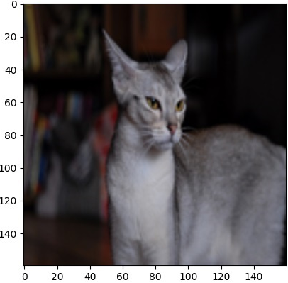
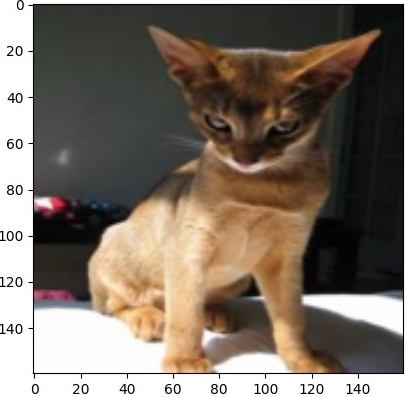
.. |input_3|      image::  ./figures/input_3.png
    :width: 300
.. |input_4|      image::  ./figures/input_4.png
    :width: 300
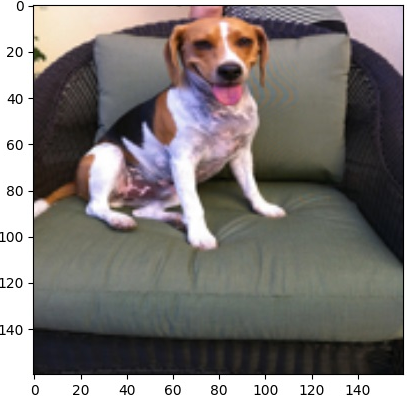
.. |input_6|      image::  ./figures/input_6.png
    :width: 300
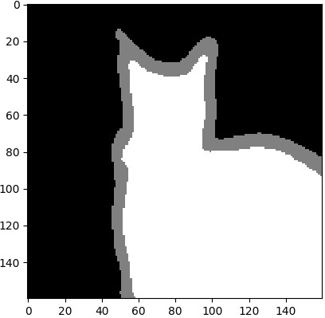
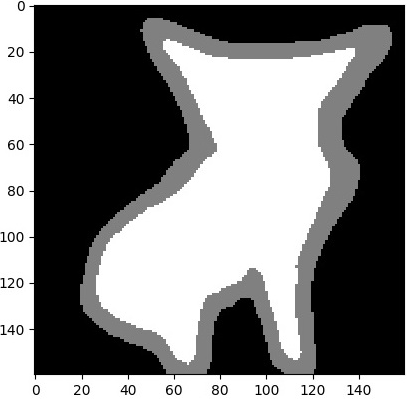
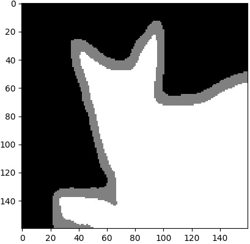
.. |inference_4|  image::  ./figures/inference_4.png
    :width: 300
.. |inference_5|  image::  ./figures/inference_5.png
    :width: 300
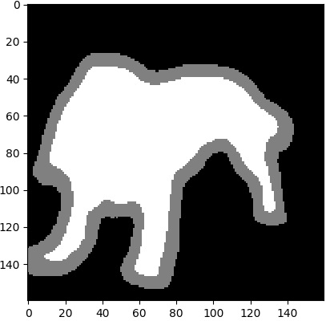
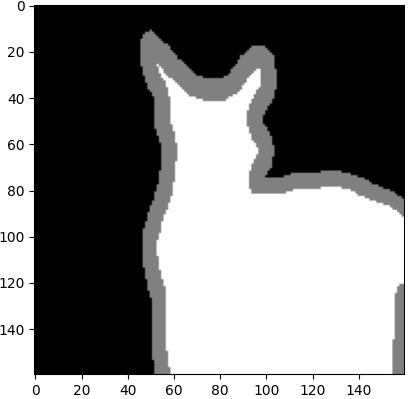
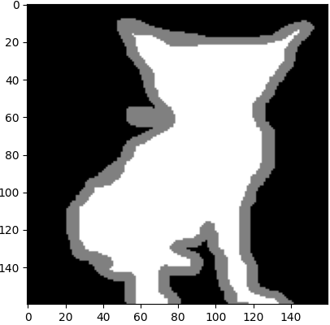
.. |truth_3|      image::  ./figures/truth_3.png
    :width: 300
.. |truth_4|      image::  ./figures/truth_4.png
    :width: 300
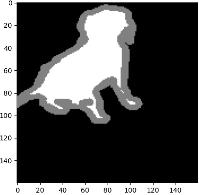
.. |truth_6|      image::  ./figures/truth_6.png
    :width: 300
   
