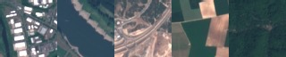
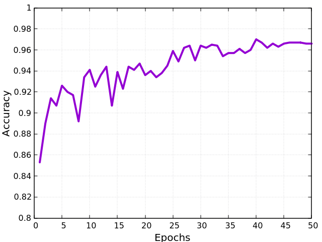

Satellite Image Clasification	
====================================================
	
Introduction
~~~~~~~~~~~~
	
This tutorial explains how to use **rmldnn** to perform transfer learning in order to train a model for the classification of Sentinel-2 satellite images. In this experiment the ResNet-50 CNN models were pretrained on the ImageNet image classification dataset with more than a million images. 

The illustration below shows an overview of the patch-based land use and land cover classification process using satellite images. A satellite scans the Earth to acquire images of it. Patches extracted out of these images are used for classification.The aim is to automatically provide labels describing the represented physical land type or how the land is used. For this purpose, an image patch is feed into a classifier, in this illustration a neural network, and the classifier outputs the class shownon the image patch.

The resulting classification system opens a gate towards a number of Earth observation applications for further advances. 
	
The Dataset
~~~~~~~~~~~
	
We will use the Sentinel-2 satellite images covering 13 spectral bands and consisting out of 10 classes with in total 27,000 labeled and geo-referenced images. The classes include River, Highway, Forest, Industrial buildings and 6 other classifications of Satellite images. The dataset is split into the ratio of 94:5:1 for train, validation and test respectively. 
	
We'll create a directory named data/ and unzip the archive inside. You should have the following directory structure:

.. code:: bash

    +-- data/
    |   +-- train/
        |   +-- AnnualCrop/
        |   +-- Forest/
        |   +-- ...
        |   +-- SeaLake/
    |   +-- valid/
        |   +-- AnnualCrop/
        |   +-- Forest/
        |   +-- ...
        |   +-- SeaLake/
    |   +-- test/
        |   +-- AnnualCrop/
        |   +-- Forest/
        |   +-- ...
        |   +-- SeaLake/

	
	
For convenience, we have already pre-processed the dataset, which can be downloaded directly from `here <https://rmldnnstorage.blob.core.windows.net/rmldnn-datasets/satellite_images.tar.gz>`__ (as a zip file). The images are multi-channel (RGB) with size 64 X 64, similar to the ones in the figure below.
	

	
The Neural Network
~~~~~~~~~~~

In order to perform transfer learning, we'll need to get our base model, which which in our case is RESNET-50 with 2 modifications:

 1. Add a single 10-unit dense layer at the end (with a log-softmax activation). 
 2. Turning all the BatchNormalisation layers as *Trainable*

After that, we'll need to save our prepared model as an HDF5 file and our network architecture as a .json file. The network is depicted below:

.. image:: ./figures/network_arch.png

For convenience, the .h5 file is available `here < >` and the network file `layers.json <./layers.json>`__ as well. 

Running Training
~~~~~~~~~~~

rmldnn is a command-line tool that makes deep-learning models easy to build and fast to train. The entire run is configured in the JSON file config.json. This file controls everything from hyperparameters to output file names. We will assume the following directory structure inside the main folder:

.. code:: bash

    +-- satellite_image_classification/
    |   +-- data/
        |   +-- train/
        |   +-- test/
        |   +-- valid/
    |   +-- model_resnet50_imagenet.h5
    |   +-- layers.json
    
To run training, we will use the following configuration file (`config_train.json <./config_train.json>`__):

.. code:: json

    {
    "neural_network": {
        "num_epochs": 50,
        "outfile": "out_classifier.txt",
        "layers": "./layers.json",
        "checkpoints": {
            "load": "./model_resnet50_imagenet.h5",
            "save": "model_checkpoints_save/",
            "interval": 5
        },
        "data": {
            "input_type":  "images",
            "target_type": "labels",
            "input_path":      "./data/train/",
            "test_input_path": "./data/valid/",
            "batch_size": 64,
            "test_batch_size": 128,
            "preload": true,
            "transforms": [
                { "resize": [64, 64] }
            ]
        },
        "optimizer": {
            "type": "Adam",
            "learning_rate": 0.05,
            "lr_scheduler": {
                "type": "Exponential",
                "gamma": 0.95
            }
        },
        "loss": {
	    "function": "NLL"
            }
        }
    }
    
    A few points to notice in the configuration:
    
    - The number of epochs is set to 50, since test accuracy shows unstable patterns and save the model out at every 5 epochs.
    - The neural network description file is specified in ``layers``
    - We use the Adam first-order optimizer with a learning rate of 0.05 with a learning rate scheduler which lowers the learning rate exponentially as we train with a gamma value of 0.95.
    - The loss function used will be NLL (Negative Log-Likelihood)
    - We will use a batch-size of 64 for training and 128 for testing
    
We will run training using a Docker image with `rmldnn` (see `instructions <https://github.com/rocketmlhq/rmldnn/blob/main/README.md#install>`__ for how to get the image). 
Using the command line, the following command will run training in parallel on a 1-GPU system:

.. code:: bash

    sudo docker run --cap-add=SYS_PTRACE --gpus=all -u $(id -u):$(id -g) -v ${PWD}:/home/ubuntu -w /home/ubuntu --rm \
    rocketml/rmldnn:latest mpirun -np 1 \
    rmldnn --config=config_rmldnn_test.json
    
rmldnn writes out two log files named after the ``outfile`` parameter in the config file. The file ``out_classifier_train.txt`` reports the loss value and gradient norm as functions of both time (in secs) as well as the epoch/batch number. The file ``out_classifier_test.txt`` reports loss and accuracy for running inference on the test dataset. 

We can monitor the run by plotting quantities like the training loss and the test accuracy, as shown below:

.. image:: ./figures/accuracy_graph.png
  :width: 400
  :align: center

    
    

	
	
