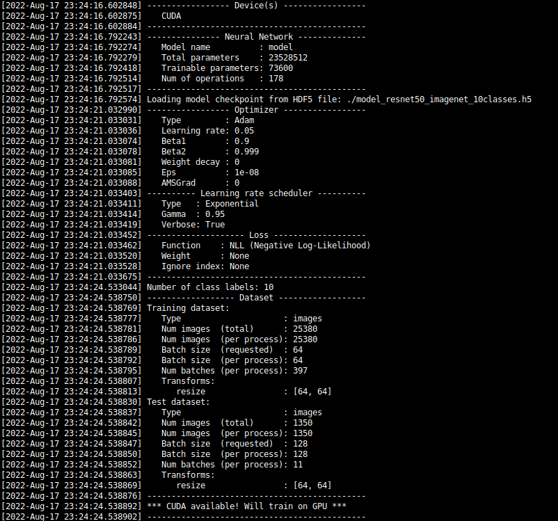
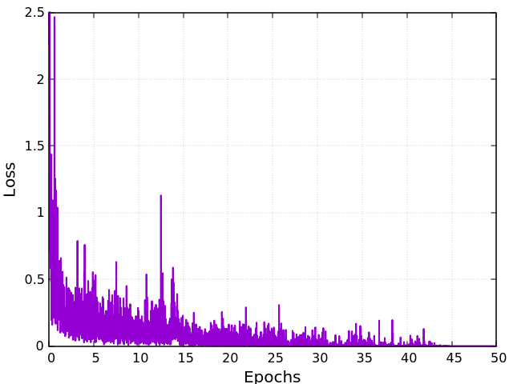

Satellite Image Classification	
==============================

Introduction
~~~~~~~~~~~~

This tutorial explains how to use **rmldnn** to perform transfer learning in order to train a model for the classification of Sentinel-2 satellite images. In this experiment, we will use a ResNet-50 CNN model pre-trained on the ImageNet dataset, which contains more than a million images and hundreds of classes.

The figure below shows an overview of the patch-based land use and land cover classification process using satellite images. A satellite scans the Earth to acquire images. Patches extracted out of these images are used for classification. The aim is to automatically provide labels describing the represented physical land type or how the land is used. For this purpose, an image patch is fed into a classifier, in this example a neural network, and the classifier predicts a class label for each image.

.. image:: ./figures/patch_extraction.png

The resulting classification system opens a gate towards a number of Earth observation applications for further advances. 

The Dataset
~~~~~~~~~~~

We will use the Sentinel-2 dataset, which contains satellite images covering 13 spectral bands and consisting of 10 classes, with a total of 27,000 labelled and geo-referenced images (`paper <https://arxiv.org/pdf/1709.00029.pdf>`__). The 10 classes are: river, highway, forest, industrial buildings, annual crop, permanent crop, vegetation, pasture, lake and residential.

We have created a directory named ``data/`` where we split the dataset into train, validation and test sets with a 94:5:1 ratio, producing the following directory structure:

.. code:: bash

    +-- data/
    |   +-- train/
        |   +-- AnnualCrop/
        |   +-- Forest/
        |   +-- ...
        |   +-- SeaLake/
    |   +-- valid/
        |   +-- AnnualCrop/
        |   +-- Forest/
        |   +-- ...
        |   +-- SeaLake/
    |   +-- test/
        |   +-- AnnualCrop/
        |   +-- Forest/
        |   +-- ...
        |   +-- SeaLake/

For convenience, we have made this pre-processed dataset available from download from `here <https://rmldnnstorage.blob.core.windows.net/rmldnn-datasets/satellite_images.tar.gz>`__ (as a tar.gz file). The images are multichannel (RGB) with size 64 X 64, similar to the ones in the figure below.

.. image:: ./figures/sample_images.jpg	
  :width: 800
  :align: center

The Neural Network
~~~~~~~~~~~~~~~~~~

In order to perform transfer learning, we'll start off with a pre-trained ResNet-50 model as base, with a few modifications:

 1. A single 10-unit dense classifier layer was added at the end (with a log-softmax activation)
 2. All **Convolutional** and **Dense** layers were frozen (i.e., marked with ``trainable = false``)
 3. However, all **BatchNormalisation** layers were unfrozen (marked as *trainable*)

The network architecture is depicted in the figure below:

.. image:: ./figures/network_arch.png

The network description file `network.json <./network.json>`__ containing the above modifications is provided in this repo, while the model parameter file can be downloaded from `here <https://rmldnnstorage.blob.core.windows.net/rmldnn-models/model_resnet50_imagenet_10classes.h5>`__ as an HDF5 file (``.h5``).

Running Training
~~~~~~~~~~~~~~~~

**rmldnn** is a command-line tool that makes deep-learning models easy to build and fast to train. The entire run is configured in a JSON configuration file. This file controls everything from hyperparameters to output file names. We will assume the following directory structure inside the main folder:

.. code:: bash

    +-- satellite_image_classification/
    |   +-- config_train.json
    |   +-- config_test.json
    |   +-- data/
        |   +-- train/
        |   +-- test/
        |   +-- valid/
    |   +-- model_resnet50_imagenet_10classes.h5
    |   +-- network.json

To run training, we will use the following configuration file (`config_train.json <./config_train.json>`__):

.. code:: json

    {
    "neural_network": {
        "num_epochs": 50,
        "outfile": "out_satellite_classifier.txt",
        "layers": "./network.json",
        "checkpoints": {
            "load": "./model_resnet50_imagenet_10classes.h5",
            "save": "./model_checkpoints/",
            "interval": 5
        },
        "data": {
            "input_type":  "images",
            "target_type": "labels",
            "input_path":      "./data/train/",
            "test_input_path": "./data/valid/",
            "batch_size": 64,
            "test_batch_size": 128,
            "preload": true,
            "transforms": [
                { "resize": [64, 64] }
            ]
        },
        "optimizer": {
            "type": "Adam",
            "learning_rate": 0.05,
            "lr_scheduler": {
                "type": "Exponential",
                "gamma": 0.95
            }
        },
        "loss": {
            "function": "NLL"
            }
        }
    }
    
A few points to notice about the configuration:
    
    - The number of epochs is set to 50 to allow for the validation accuracy to stabilize.
    - We will save a model checkpoint under ``./model_checkpoints/`` at every 5 epochs.
    - The neural network description file is specified in ``layers``
    - We use the Adam first-order optimizer with a learning-rate of 0.05 and an exponential learning-rate scheduler that dampens the LR by a factor of 0.95 after each epoch.
    - The loss function used will be NLL (Negative Log-Likelihood)
    - We will use a batch size of 64 for training and 128 for testing
    
We will run training using a Docker image with `rmldnn` (see `instructions <https://github.com/rocketmlhq/rmldnn/blob/main/README.md#install>`__ for how to get the image). 
The following command can be used to run training on a single-GPU system:

.. code:: bash

    sudo docker run --gpus=all -u $(id -u):$(id -g) -v ${PWD}:/home/ubuntu -w /home/ubuntu --rm \
    rocketml/rmldnn:latest mpirun -np 1 rmldnn --config=config_train.json

**rmldnn** writes out two log files named after the ``outfile`` parameter in the config file. The file ``out_satellite_classifier_train.txt`` reports the loss value and gradient norm as functions of both time (in secs) and epoch/batch number. The file ``out_satellite_classifier_test.txt`` reports loss and accuracy for running inference on the validation set. 

We can monitor the run by plotting quantities like the training loss and the test accuracy, as shown below. It takes
about 10 minutes to train until 50 epochs on an NVIDIA Tesla-A100X GPU.

.. image:: ./figures/accuracy.png
  :width: 400
  :align: center
   
Running inference on a pre-trained model
~~~~~~~~~~~~~~~~~~~~~~~~~~~~~~~~~~~~~~~~

We can now use the model checkpoint saved after the 50th epoch to run stand-alone inference on the test subset of the original dataset, containing 1% of the EuroSAT Satellite images (which is 270 images). This simple configuration file
(`config_test.json <./config_test.json>`__)
can be used to run `rmldnn` inference:

.. code:: bash

    {
        "neural_network": {
            "layers": "./network.json",
            "checkpoints": {
                "load": "./model_checkpoints/model_checkpoint_50.pt"
            },
            "data": {
                "input_type": "images",
                "test_input_path":  "./data/test/",
                "test_output_path": "./predictions/",
                "transforms": [
                    { "resize": [64, 64] }
                ]
            }
        }
    }

We can use the following command to run inference on a 1-GPU system:

.. code:: bash

    sudo docker run --gpus=all -u $(id -u):$(id -g) -v ${PWD}:/home/ubuntu -w /home/ubuntu --rm \
    rocketml/rmldnn:latest mpirun -np 1 rmldnn --config=config_test.json

The output of the classification is an HDF5 file named ``predictions/output_1.h5`` containing one dataset for each input sample. Since the model predicts a probability for each sample to be of one out of 10 possible classes, those datasets will be of shape ``(10,)``. To obtain the actual predicted classes and calculate the accuracy, one needs to take the *argmax* of each array and count the number of correct predictions. This is done in the below script (available as `compute_accuracy.py <./compute_accuracy.py>`__):

.. code:: python

    import numpy as np
    import h5py as h5
    
    right = 0
    total = 0
    class_labels = { "AnnualCrop"           :0,
                     "Forest"               :1,
                     "HerbaceousVegetation" :2,
                     "Highway"              :3,
                     "Industrial"           :4,
                     "Pasture"              :5,
                     "PermanentCrop"        :6,
                     "Residential"          :7,
                     "River"                :8,
                     "SeaLake"              :9
                   }
    
    h5file = h5.File('./predictions/output_1.h5', 'r')
    
    for group in h5file:
        for dset in h5file[group]:
            pred_label = np.argmax(h5file[group][dset][()])
            if pred_label == class_labels[group]:
                right += 1
            total += 1
    
    print(f"Accuracy: {100 * right / total:.1f}%")

By executing the script, we obtain an accuracy of 96.3% on the test dataset, which is consistent with the 97% accuracy we obtained on the validation set during training:

.. code:: bash

    python ./compute_accuracy.py
    Accuracy: 96.3%

