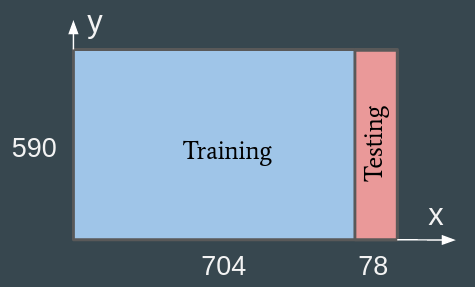
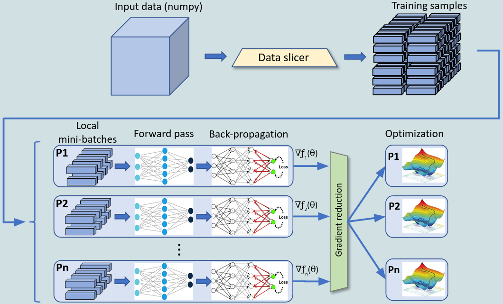
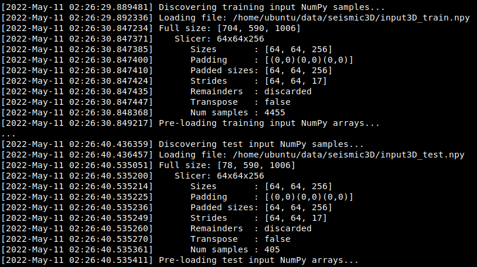
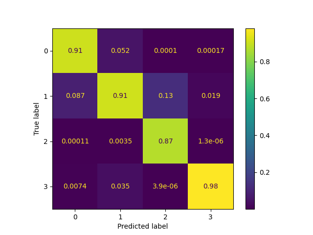
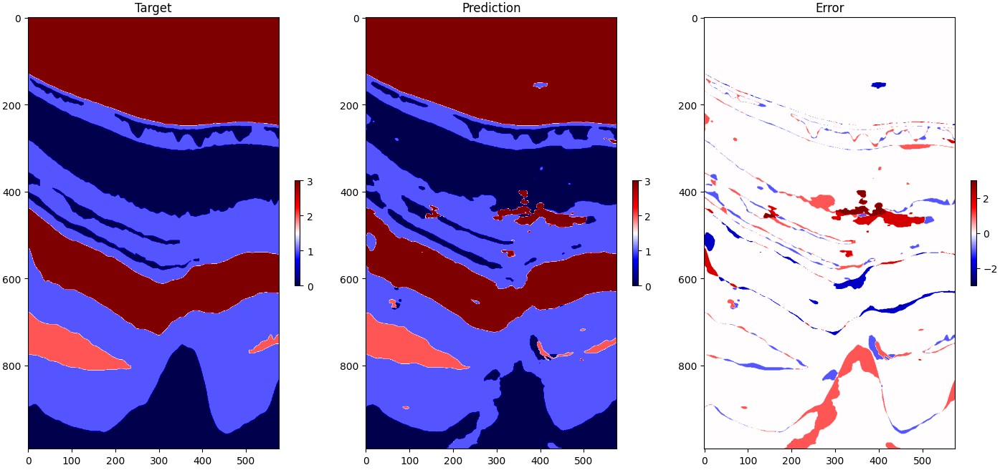

Seismic facies classification using CNNs
========================================

Introduction
~~~~~~~~~~~~

Seismic facies classification refers to the task of identifying and interpreting different types of
geological patterns in the Earth's subsurface. It plays a key role in the characterization, 
exploration and prospecting of hydrocarbon reservoirs. As the available 3D seismic data grows in complexity 
and size, manual facies interpretation has become prohibitively time-consuming and error-prone. 
For those reasons, automatic seismic analysis techniques have become extremely important in the 
last several years. In that context, deep-learning (DL) has emerged as a prominent tool in this field.
Convolutional Neural Networks (CNNs), in particular, which have been shown to perform very well in image
processing and pattern recognition tasks, have been actively applied to facies classification problems 
in the last several years.

In this tutorial, we will show how to use `rmldnn` to efficiently train a CNN to classify seismic
facies in 3D geological data. The goal is to obtain a 3D segmentation model that can accurately
mark every pixel of the input data with numbers from 0 to N-1, where N is the number of different 
facies types (see `here <https://www.aicrowd.com/challenges/seismic-facies-identification-challenge>`__
for a similar challenge).

The dataset
~~~~~~~~~~~

We will use a modified version of a 3D seismic image from a public seismic dataset called
`Parihaka` survey, named after the region off the coast of New Zealand where it was generated.
Three orthogonal cuts of the data are shown in the figure below.

.. image:: ./figures/parihaka.png
  :width: 650

The dataset consists of a 3D image (in numpy format) of size 782 x 590 x 1006 stored in (x, y, z) order.
Labels corresponding to the training data are integers from 0 to 3, arranged as an array of the same shape
(the original Parihaka dataset contains 6 labels but, for the purpose of this tutorial,
we combined 3 low-population classes together and created a 4-class dataset that will train faster).

We have partitioned the data into training and test sets by splitting the block at x = 704,
as depicted below, thus obtaining a training block of size 704 x 590 x 1006
and a test block of size 78 x 590 x 1006.
The same operation was performed with label (target) data.
The resulting files can be downloaded from
`here <https://rmldnnstorage.blob.core.windows.net/rmldnn-datasets/parihaka_4class.tar.gz>`__.

 
Data slicing
~~~~~~~~~~~~

We need to split the data into smaller blocks that can be used as training samples, i.e., 
assembled into mini-batches and forwarded through the neural network. Although this can be done as an external
pre-processing step, the data slicing feature in `rmldnn` allows splitting a large
`D`-dimensional numpy input file into multiple `d`-dimensional small blocks **inline** 
(i.e., no disk I/O involved), for any d <= D <= 3. The resulting samples are then fed into the
network for training and evaluation, as shown below.

The configuration of the slicer module is very simple, and is described in detail in the 
`documentation <https://rocketmlhq.github.io/rmldnn/deep_neural_networks.html#slicers-sub-section>`__.
We want to generate one set of 3D bricks of size 64 x 64 x 256. We choose a longer length in
the `z`-direction due to the asymmetric nature of the seismic data, where the facies types change
more rapidly in the depth direction. In addition, we want to augment the dataset by generating blocks
that overlap in `z` by a large amount. This can be accomplished with this configuration:

.. code:: bash

    "slicers": [
        {
            "name":    "samples",
            "sizes":   [64, 64, 256],
            "strides": [64, 64, 17],
            "discard_remainders": true
        }
    ],

A few points to notice:

 - By setting the stride amount to 17 in the `z`-direction, along which the block size is 256,
   we achieve an overlap of 93% in that direction.
 - We set `discard_remainders` to true, so that leftover volumes are discarded. By default,
   they would be padded and used for training, which we found to hurt accuracy in this particular case.

The model
~~~~~~~~~

We will use a 3D Unet neural network as our model, as depicted in the figure below.
The network description file is 
`unet3d_seismic.json <./unet3d_seismic.json>`__,
and the network graph is shown in 
`here <./unet3d_seismic.pdf>`__.
The last layer outputs a tensor with 4 values per pixel, corresponding to the probabilities of
that pixel belonging to each of the 4 classes of seismic facies.

.. image:: ./figures/unet3d.png
  :width: 650

Training the model
~~~~~~~~~~~~~~~~~~

To train the Unet-3D model on the seismic dataset, we will use the following configuration file:

.. code:: bash

    {
        "neural_network": {
            "outfile": "out_seismic3d.txt",
            "checkpoints": {
                "save": "./model_seismic3d/",
                "interval": 2
            },
            "layers": "./unet3d_seismic.json",
            "num_epochs": 20,
            "data": {
                "type": "numpy",
                "input_path":       "./parihaka/input3D_train.npy",
                "target_path":      "./parihaka/target3D_train.npy",
                "test_input_path":  "./parihaka/input3D_test.npy",
                "test_target_path": "./parihaka/target3D_test.npy",
                "batch_size": 16,
                "test_batch_size": 16,
                "preload": true,
                "slicers": [
                    {
                        "name":    "samples",
                        "sizes":   [64, 64, 256],
                        "strides": [64, 64, 17],
                        "discard_remainders": true
                    }
                ]
            },
            "optimizer": {
                "type": "Adam",
                "learning_rate": 1e-4
            },
            "loss": {
                "function": "NLL"
            }
        }
    }

A few points to notice in the configuration:

 - As explained earlier, the slicer module is used to extract samples (3D blocks) from the 
   large training and test input files
 - We use the Adam first-order optimizer with a learning rate of 0.0001
 - We use the negative log-likelihood loss function. When the network outputs a higher-dimensional 
   tensor (e.g., in segmentation problems), this function computes a per-pixel loss
 - The training and test batch sizes are set to 16
 - We will train for 20 epochs and save the model out at every 2 epochs

We will run training on 4 NVIDIA V100 GPUs using a Singularity image with `rmldnn` 
(see `instructions <https://github.com/rocketmlhq/rmldnn/blob/main/README.md#install>`__ for how to get the image).
From the command line, one should do:

.. code:: bash

  $ singularity exec --nv ./rmldnn_image.sif \
    mpirun -np 4 -x CUDA_VISIBLE_DEVICES=0,1,2,3 \
    rmldnn --config= ./config_dnn_seismic3d.json

Observe in the log how the slicer reports the creation of 4455 training samples and 405 test samples
from the given input data:

It takes about 2 hours to train for 20 epochs on 4 GPUs. 
We can monitor the evolution of the training loss, which is reported in the log file
``out_seismic3d_train.txt``. The loss seems to have reached a stationary value after 20 epochs,
as shown below.

.. image:: ./figures/loss_training.png
  :width: 600
  :align: center

Making predictions with the trained model
~~~~~~~~~~~~~~~~~~~~~~~~~~~~~~~~~~~~~~~~~

We also instructed `rmldnn` to periodically evaluate the model by running inference
on the test samples, and the results can be found in ``out_seismic3d_test.txt``. 
The accuracy achieved (measured as the Dice coefficient averaged among all classes)
is about 87%. This was achieved by averaging over the accuracies obtained from 
running inference on all 405 test slabs, each of size 64 x 64 x 256.

The accuracy can be substantially improved by running inference on the full test slab instead.
For that, we will need to:

 - Resize the test slab such that each dimension is a multiple of 16, so that it can be forwarded
   through the Unet. We will do that using the slicer and setting the
   slab size to 64 x 576 x 992 (and discarding remainders).
 - Run inference on a system with at least 32GB or free RAM, given the size of the input sample.

The following configuration will be used:

.. code:: bash

    {
        "neural_network": {
            "checkpoints": {
                "load": "./model_seismic3d/model_checkpoint_20.pt"
            },
            "layers": "./unet3d_seismic.json",
            "data": {
                "type": "numpy",
                "test_input_path":  "./parihaka/input3D_test.npy",
                "test_target_path": "./parihaka/target3D_test.npy",
                "test_output_path": "./prediction/",
                "test_batch_size": 1,
                "slicers": [
                    {
                        "name":  "test_sample",
                        "sizes": [64, 576, 992],
                        "discard_remainders": true
                    }
                ]
            },
            "loss": {
                "function": "Dice",
                "source": "log_softmax"
            }
        }
    }

The setting ``test_output_path = ./prediction/`` instructs `rmldnn` to save the prediction
as an ``HDF5`` file under ``./prediction/``.

We will run inference on a single multi-core CPU node, which has enough memory to
handle a 64 x 576 x 992 input sample. We run the following command:

.. code:: bash

  $ singularity exec --env OMP_NUM_THREADS=8 ./rmldnn_image.sif \
    rmldnn --config= ./config_dnn_seismic3d_inference.json

We can now use `scikit-learn` to compute accuracy metrics and plot the
confusion matrix, comparing our prediction to an equally-shaped chunk from the test target:

.. code:: python

    import numpy as np
    import h5py as h5
    import sklearn.metrics
    from matplotlib.pyplot import show

    pred_file = './prediction/output_1.h5'
    trgt_file = './parihaka/target3D_test.npy'

    pred = h5.File(pred_file, 'r')['0:64,0:576,0:992'][()].argmax(0)
    target = np.load(trgt_file)[:64, :576, :992]
    print(sklearn.metrics.classification_report(pred.flatten(), target.flatten()))

                  precision    recall  f1-score   support
    
               0       0.91      0.92      0.91   9397449
               1       0.91      0.91      0.91  13749251
               2       0.87      0.95      0.91    933102
               3       0.98      0.96      0.97  12489286

        accuracy                           0.93  36569088
       macro avg       0.92      0.93      0.93  36569088
    weighted avg       0.93      0.93      0.93  36569088

    cm = sklearn.metrics.confusion_matrix(pred.flatten(), target.flatten(), normalize='pred')
    disp = sklearn.metrics.ConfusionMatrixDisplay(cm) 
    disp.plot()
    show()

Notice that we achieve an overall accuracy of **93%**, as measured by the
average F1-score (same as the Dice coefficient) over all classes.
This is an improvement over the previous value of 87% obtained from smaller test samples.

Finally, we can visualize the results by plotting slices of prediction and target slabs
along, say, the `y-z` plane:

.. code:: bash

    import numpy as np
    import h5py as h5
    import matplotlib.pyplot as plt
    
    def display_slices(pred, target):
        fig, ax = plt.subplots(1, 3, figsize=[40, 40])
        ax[0].set_title('Target')
        im0 = ax[0].imshow(target, origin='upper', cmap='seismic')
        ax[1].set_title('Prediction')
        im1 = ax[1].imshow(pred, origin='upper', cmap='seismic')
        ax[2].set_title('Error')
        im2 = ax[2].imshow(pred - target, origin='upper', cmap='seismic')
        fig.colorbar(im0, ax = ax[0], shrink=0.2)
        fig.colorbar(im1, ax = ax[1], shrink=0.2)
        fig.colorbar(im2, ax = ax[2], shrink=0.2)
        plt.show() 
    
    pred = h5.File('./prediction/output_1.h5', 'r')['0:64,0:576,0:992'][()].argmax(0)
    target = np.load('./parihaka/target3D_test.npy')[:64, :576, :992]
    
    x = 32
    display_slices(pred[x, :, :].transpose(), target[x, :, :].transpose())

Although the agreement between prediction and target is pretty good, it certainly can be improved.
A few things that could be tried to improve the accuracy are:

 - Use a deeper 3D Unet, as the added trainable parameters could increase the learning capacity
   of the network.
 - Increase the overlap between training blocks, maybe by also overlapping in `x` and `y` directions,
   thus generating even more training samples.
 - Try different block shapes and sizes for the training samples.
 - Experiment with different optimizers and their hyper-parameters, perhaps using 
   some type of learning-rate scheduler.
 - Experiment with other loss functions. We tried the Dice loss for this problem, but it performed slightly 
   worse than plain NLL, surprisingly. Perhaps using a weighted loss or other
   segmentation losses (e.g., Focal or Lovasz) might help.
